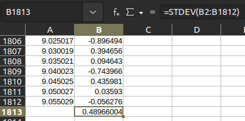
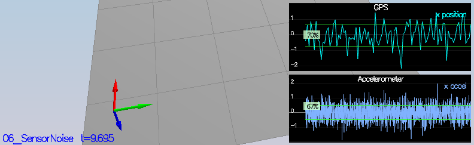
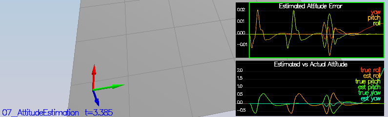
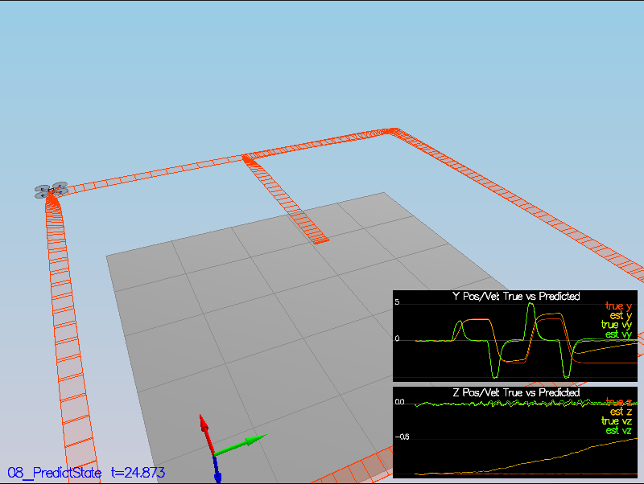
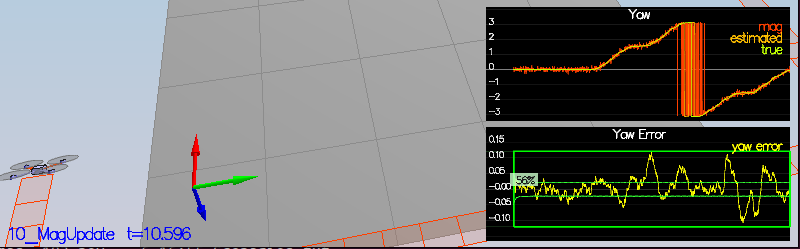
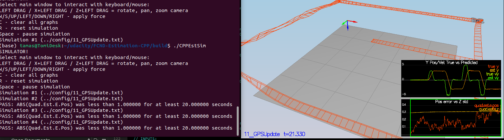

## Determine the standard deviation of the measurement noise of both GPS X data and Accelerometer X data.

The standard deviation was determined by LibreOffice using the following formula between the first (`B1`) and the last lines (`1812`)
```excel
=stdev(B1:1812)
```
Which happenend to be 0.4897 for acceleration and 0.7093 for GPS.



Success criteria: 
 ### &check; The standard deviations should accurately capture the value of approximately ~68% of the respective measurements 




## Implement a better rate gyro attitude integration scheme in the UpdateFromIMU() function.

### &check; The improved integration scheme results in an attitude estimator of < 0.1 rad for each of the Euler angles for a duration of at least 3 seconds during the simulation.

A Nonlinear Complementary Filter was utilized according to the refernced whitepaper [Estimation for Quadrotors](https://www.overleaf.com/project/5c34caab7ecefc04087273b9) 7.1.2


```cpp
auto yawPitchRollQuaternion = Quaternion<float>::FromEuler123_RPY(rollEst, pitchEst, ekfState(6));
yawPitchRollQuaternion.IntegrateBodyRate(gyro, dtIMU);

float predictedPitch = yawPitchRollQuaternion.Pitch();
float predictedRoll = yawPitchRollQuaternion.Roll();
ekfState(6) = yawPitchRollQuaternion.Yaw();


// normalize yaw to -pi .. pi
if (ekfState(6) > F_PI) ekfState(6) -= 2.f*F_PI;
else if (ekfState(6) < -F_PI) ekfState(6) += 2.f*F_PI;
```



## Implement all of the elements of the prediction step for the estimator.



This step just advances the predicted state by the way of simple integration
```cpp
predictedState(0) = curState(0) + dt * curState(3);
predictedState(1) = curState(1) + dt * curState(4);
predictedState(2) = curState(2) + dt * curState(5);

V3F accelI (attitude.Rotate_BtoI(accel));

predictedState(3) = curState(3) + dt * accelI.x;
predictedState(4) = curState(4) + dt * accelI.y;
predictedState(5) = curState(5) + dt * accelI.z - dt * CONST_GRAVITY;
```
## Implement the magnetometer update

This is a straight forward implementation as it is a direct reding of the measured yaw; the only thing to make sure is that the reading is properly clamped between -2 $\pi$ and +2 $\pi$ and.

Again since this is linear, the derivative h'(x_t) is a matrix of zeros and ones: 
$$
\begin{align}
  z_t=  \left[\begin{array}{c}
      \psi
      \end{array}\right]
  \end{align}
$$

$$
\begin{align}
  h(x_t) =  \left[\begin{array}{c}
      x_{t,\psi}
      \end{array}\right]
\end{align}
$$
Again since this is linear, the derivative is a matrix of zeros and ones: 

$$
\begin{align}
  h'(x_t) = \left[\begin{array}{ccccccc}
      0&0&0&0&0&0&1
      \end{array}\right]
\end{align}
$$

```cpp
MatrixXf hPrime(1, QUAD_EKF_NUM_STATES);
hPrime(6) = 1;
```

  
### &check; error should be the short way around, not the long way

## Implement the GPS update

This is a very simple update

The state space is simplified to igonore heading, pitch and roll (with the respecitve derivates), hence it only includes position and speed:
$$
\begin{align}
  z_t &= \left[ \begin{array}{c}
      x\\
      y\\
      z\\
      \dot{x}\\
      \dot{y}\\
      \dot{z}\\
      \end{array} \right]
\end{align}
$$ 

The measurement model is as follows:
$$
\begin{align}
  h(x_t) = \left[\begin{array}{c}
      x_{t,x}\\
      x_{t,y}\\
      x_{t,z}\\
      x_{t,\dot{x}}\\
      x_{t,\dot{y}}\\
      x_{t,\dot{z}}\\
    \end{array}\right]
\end{align}
$$

The simulator is now set witht the following parameters and a non-ideal estimator:
```bash
[QuadControlParams]

UseIdealEstimator=0

# Physical properties
Mass = 0.5
L = 0.17
Ixx = 0.0023
Iyy = 0.0023
Izz = 0.0046
kappa = 0.016
minMotorThrust = .1
maxMotorThrust = 4.5

# Position control gains
kpPosXY = 3
kpPosZ = 10
KiPosZ = 40

# Velocity control gains
kpVelXY = 6
kpVelZ = 30

# Angle control gains
kpBank = 20
kpYaw = 1.6

# Angle rate gains
kpPQR = 50, 50, 10

# limits
maxAscentRate = 5
maxDescentRate = 2
maxSpeedXY = 5
maxHorizAccel = 12
maxTiltAngle = .7
```

I've swapped the `QuadControl.cpp` file with the one made in the previous project, and the tuning was conducted one this one. (The original file is still kept in the repo for refernce as `QuadControl.original.cpp`).  
The result is a somewhat bumpy ride, yet within the specification envelope. (this could be surely further refined.)



### &check; The simulation has completed the entire simulation cycle with estimated position error of < 1m.
